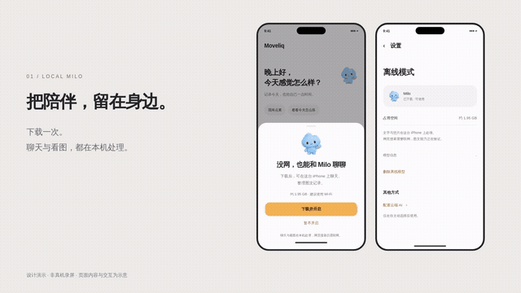
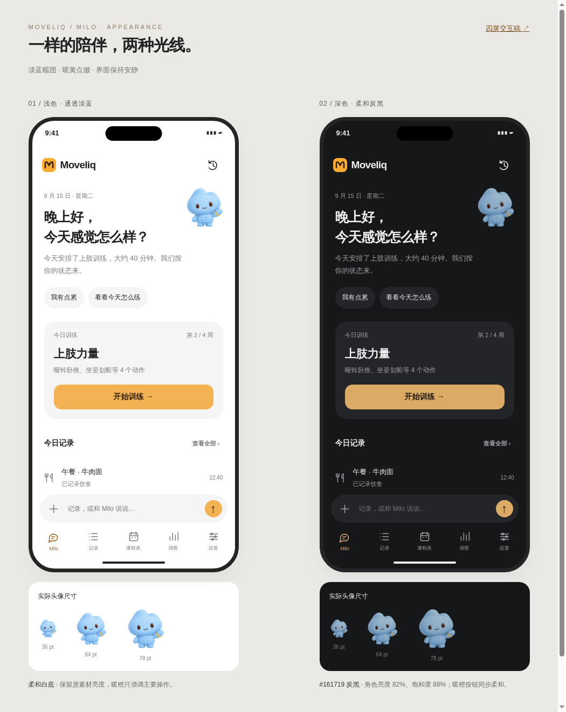

<div align="center">


<h1>Moveliq</h1>

[](LICENSE)


[](https://github.com/MinJung-Go/Agentic-KeepKeep/actions/workflows/ios.yml)

**和运动伙伴 Milo 一起，用一句话记录训练与饮食，回顾身体状态，安排适合自己的训练。**

</div>

---

## 界面示意

[](docs/19-local-milo/design-video.mp4)

[观看 24 秒设计短片（MP4）](docs/19-local-milo/design-video.mp4) · [六屏交互设计稿](docs/19-local-milo/design.html)

> 以上为设计稿演示，非真机录屏。第 19 轮本地图文与浏览器功能正在验证，不能视为已通过 iPhone 性能或可用性验收。

Milo 是 Moveliq 的运动伙伴，默认出现在首页；称呼与相处方式可在设置中自定义。新版形象采用淡蓝小糯团、黄色手环与同色浅腹肌。

<p align="center">
  
</p>

> 上图为 HTML 设计预览，非真机截图；训练与记录内容均为演示。新版 Milo、深色角色调色与背景适配已接入当前源码，已通过 0.4.10 (14) 的 iOS 编译与 353 项单测，真机效果待验收；请以对应构建的提交与版本为准。

[浅深色对照稿](docs/18-milo-home/design-milo-themes.html) · [四屏交互稿](docs/18-milo-home/design.html) · [设计需求](docs/18-milo-home/requirements.md) · [实施清单](docs/18-milo-home/checklist.md)

HTML 文件可下载后在浏览器打开；GitHub 文件页展示的是源码。

## 这个项目解决什么

现有健身应用（Keep、Apple Fitness+ 等）的记录依赖繁琐的点选表单，分析停留在静态图表，课程是固定模板。Moveliq 的差异：

| 维度 | 常见做法 | 本项目 |
|------|---------|--------|
| 记录方式 | 点选表单 | 自然语言一句话，LLM 结构化解析后由你确认 |
| 分析 | 静态图表 | AI 跨维度关联（训练 × 睡眠 × 饮食），主动指出平台期 |
| 课程表 | 固定模板课程 | 对话生成课程表，按完成情况与恢复状态调整 |
| 数据归属 | 厂商云 | 本地 SwiftData，BYOK 直连 LLM，无自建服务器 |

## 能做什么

- **自然语言记录**：「深蹲100kg 5×5」「中午吃了牛肉面」→ 解析成结构化记录；解析结果先过确认卡片，每个字段可改
- **失败不丢数据**：解析失败时原文存为「待归类」笔记，联网或有 Key 后可重新解析
- **AI 周报**：基于本地聚合摘要分析渐进超负荷、平台期、训练与睡眠/饮食的关联；报告标注 AI 依据
- **对话式课程表**：和 Milo 说明目标与器械，通过 function call 生成周期化计划，确认后写入；支持手动增删改，也支持让 Milo 提出减载/换动作建议
- **饮食分析**：日均热量与宏营养素、蛋白质目标缺口、每日热量图
- **照片估算热量**：拍一张食物照片，估算组成与热量（标注为 AI 估算，可修正）
- **健康数据接入**：HealthKit 只读同步睡眠、HRV、静息心率、步数与运动记录（含 Apple Watch 训练，按 UUID 去重）
- **趋势图表**：体重、动作估算 1RM、每周训练容量、睡眠
- **语音输入 / 桌面小组件 / JSON 数据导出**

## 安装与启动

### 方式一：下载未签名 IPA（不需要 Mac）

当前分支已改用 **Qwen3.5-0.8B MLX 4bit**：从 ModelScope 下载约 **645 MB**，保持原有角色、历史与工具流程，8K 上下文。升级后需下载新模型；旧 2B 不会作为新版启用。[本轮修复与验证](docs/22-local-memory/checklist.md)。[下载 IPA · 0.5.1（22）](https://github.com/MinJung-Go/Agentic-KeepKeep/actions/runs/35483344157/artifacts/10596852788)：397 项 iOS 单测通过，Release 归档成功；L14 与工具／图文质量待同设备复测。下方为上一版本。

[MLX 正式接入 IPA · 0.5.0（21）](https://github.com/MinJung-Go/Agentic-KeepKeep/actions/runs/35380521646/artifacts/10562367633)：393 项 iOS 单测通过，正式 App 已接入 MLX 文字／单图推理与后台下载。默认从 ModelScope 下载约 1.74 GB 新模型，旧 GGUF 不兼容；图文真机性能与任务质量仍待验收。[需求与 checklist](docs/21-mlx-production/checklist.md) · [安装说明与验证边界](docs/21-mlx-production/validation.md)。

仓库自带 GitHub Actions 流水线，打 tag 会自动构建并产出未签名 IPA：

1. 打开 [Actions](https://github.com/MinJung-Go/Agentic-KeepKeep/actions/workflows/ios.yml) → 选择 `v*` tag 触发的运行 → 下载 `KeepKeep-unsigned-ipa`
2. 用 AltStore / Sideloadly 等工具自签安装到 iPhone（免费 Apple ID 需每 7 天重签）

> HealthKit 与小组件依赖最终签名中的能力授权。缺少权限时，其他记录与 AI 功能仍可使用。不能仅凭缺少 entitlement 判断必须购买开发者会员；重新签名后可在设置中重新授权。

### 方式二：从源码构建

需要 macOS + Xcode 16.4（Swift 6.1）或更新版本，以及 [XcodeGen](https://github.com/yonaskolb/XcodeGen)：

```bash
brew install xcodegen
git clone https://github.com/MinJung-Go/Agentic-KeepKeep.git
cd Agentic-KeepKeep
python3 scripts/verify_no_exercise_dataset.py AgenticKeepKeep  # 检查无旧动作数据集
xcodegen generate
open AgenticKeepKeep.xcodeproj
```

正式 App 通过 Swift Package Manager 链接 MLX Swift 0.31.3 / MLX Swift LM 2.31.3，首次构建会下载依赖；模型权重从 ModelScope 在 App 内下载，不打包进 IPA。

`.xcodeproj` 由 `project.yml` 生成，不进版本库。在 Xcode 中选择自己的开发团队后即可运行到真机。

## 第一次使用

1. 打开 App，完成三页引导（HealthKit 授权与 API Key 都可以跳过）
2. 「设置 → AI 模型」选择服务商并填入 API Key，点「连接测试」确认真实可用
   - 默认预设为智谱 GLM（`glm-5.3-flash`）；也可切换 OpenAI、Claude（Anthropic 原生协议）或任意 OpenAI 兼容端点
   - 模型名可在设置里直接改，请以服务商文档为准
3. 回到「Milo」首页（标签随角色称呼变化），在底部输入条输入「深蹲100kg 5×5，有点累」→ 确认卡片 → 保存，记录出现在「记录」页

## 权限与数据

| 权限 | 用途 | 说明 |
|------|------|------|
| HealthKit（读） | 睡眠、HRV、静息心率、步数、运动记录 | 只读，不回写 HealthKit |
| 相机 / 相册 | 食物照片估算热量 | 照片随记录存本机 |
| 麦克风 / 语音识别 | 语音转写为记录文本 | 使用系统 Speech 框架 |

- API Key 保存在系统钥匙串（Keychain），不写入任何配置文件或日志
- 没有自建服务器，不做云端同步
- 发给 LLM 的只有两样：你输入的那句话，以及聚合后的统计摘要（例如「近 7 天训练 4 次、日均睡眠 6.2 小时、深蹲停滞 3 周」）。逐条原始记录不会离开设备
- 可随时在「设置 → 数据」导出全部数据为 JSON

## 支持的平台

- iOS 17.0 及以上（iPhone）
- 桌面小组件：WidgetKit（依赖 App Group，见上）
- 构建环境：Xcode 16+ / XcodeGen 2.38+；CI 在 `macos-latest` 上构建与测试

## 已知限制

- 未上架 App Store，只能自签安装；HealthKit 与小组件是否可用取决于最终签名权限，需真机验证
- 照片识别与语音输入在模拟器上可能不可用，需真机验证
- 热量与宏营养素为 AI 估算值，不是称重结果
- 分析报告由 AI 生成，仅供参考，不构成医疗建议
- 目前只在中文语境下验证（提示词、日期与语音识别语言均为中文）

## 开发

```bash
python3 scripts/verify_no_exercise_dataset.py AgenticKeepKeep  # 检查无旧动作数据集
bash scripts/build_local_runtime.sh  # 首次构建本地图文引擎（只需在引擎版本变化后重建）
xcodegen generate   # 生成 Xcode 工程

# 本机（需 macOS）
xcodebuild test -project AgenticKeepKeep.xcodeproj -scheme AgenticKeepKeep \
  -destination 'platform=iOS Simulator,name=iPhone 15 Pro'
```

架构：`Features/`（SwiftUI UI）→ `Core/Agents/`（ParserAgent / CoachAgent / AnalystAgent / VisionAgent，纯逻辑可单测）→ `Core/LLM/`（BYOK 协议抽象，OpenAI 兼容 + Anthropic 原生）→ `Core/Data/`（SwiftData，唯一数据源）。测试结果以对应提交的 GitHub Actions 为准；主分支推送、PR 与手动触发可运行构建和测试。

文档按轮次组织（索引与约定见 [docs/README.md](docs/README.md)）：

- 轮次 01 · 项目基线：[需求文档](docs/01-foundation/requirements.md)（P0/P1/P2 分级与明确不做清单）· [实施清单](docs/01-foundation/checklist.md) · [界面设计稿](docs/01-foundation/design.html)（HTML 高保真稿，非真机截图）
- 轮次 02 · 真机反馈修复：[实施清单](docs/02-device-feedback/checklist.md)
- 轮次 03 · 教练流式与个人数据：[需求文档](docs/03-coach-streaming/requirements.md) · [实施清单](docs/03-coach-streaming/checklist.md)

- 轮次 18 · Moveliq 品牌与 Milo 首页：[需求文档](docs/18-milo-home/requirements.md) · [实施清单](docs/18-milo-home/checklist.md) · [浅深色设计对照](docs/18-milo-home/design-milo-themes.html)

## 许可证

[MIT](LICENSE) © 2026 MinJung-Go

### HealthKit 侧载签名

CI 产出的 IPA 带 ad-hoc 签名，用于携带 HealthKit / App Group 能力声明，仍需安装工具向 Apple 申请相应描述文件并重新签名。历史 artifact 名中的 unsigned 表示尚未完成设备安装签名。Windows 可用 Impactor 验证；仅替换安装工具不保证最终权限获准。授权失败后可在设置重新授权，详见 [修复清单](docs/10-healthkit-sideload/checklist.md)。
